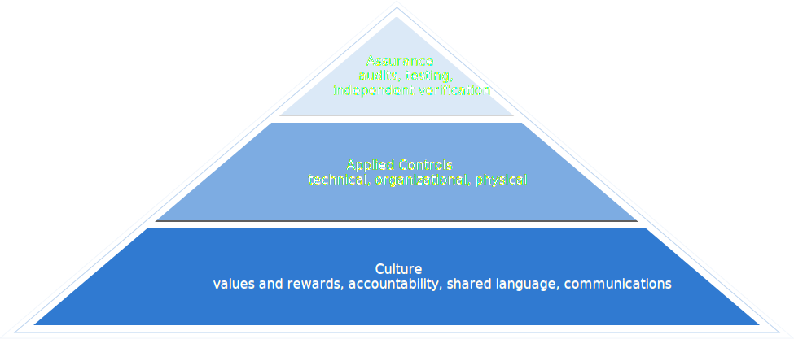

# Security as a Hierarchy

Many of the security breaches you read about in the news are not insane novel attacks, they’re a result of inattention and lapses in judgment. Reusing passwords, using weak/guessable passwords, getting phished, not using MFA, not encrypting laptops, stuff like that.

All of the technical controls in the world won’t matter unless your workforce understands why they are important. Policies and procedures just gather bit dust if no one understands the risks you face.

As management, how you praise, reward, and punish people does more to affect security and privacy than any other factor or control. Do potential security and privacy incidents actually get reported? Do people cut corners with passwords and shared accounts? Are your security and privacy personnel given enough time, money, and people to realistically achieve their goals? Are those goals prioritized and recognized, in performance reviews or otherwise?

We use this triangle diagram, like Maslow’s hierarchy of needs, to illustrate the concept that you need to build up a base of cultural capital before you can consistently and effectively apply controls to protect data.

You almost never receive immediate negative feedback when security and privacy start to rot within your organization. It’s a slow process and it starts with people.

Without good culture, trying to implement security and privacy leads to missed deadlines, slow progress, and the sense in your organization that security controls are more of a nuisance than they’re worth.
