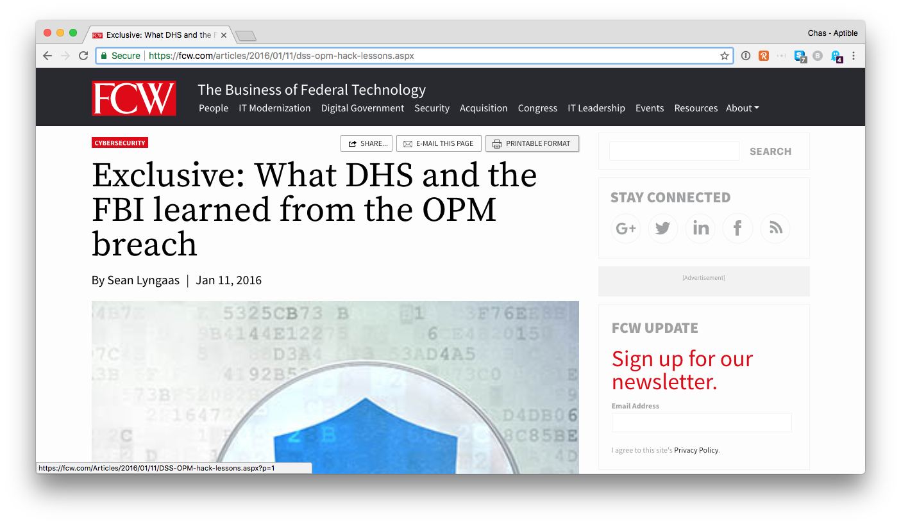
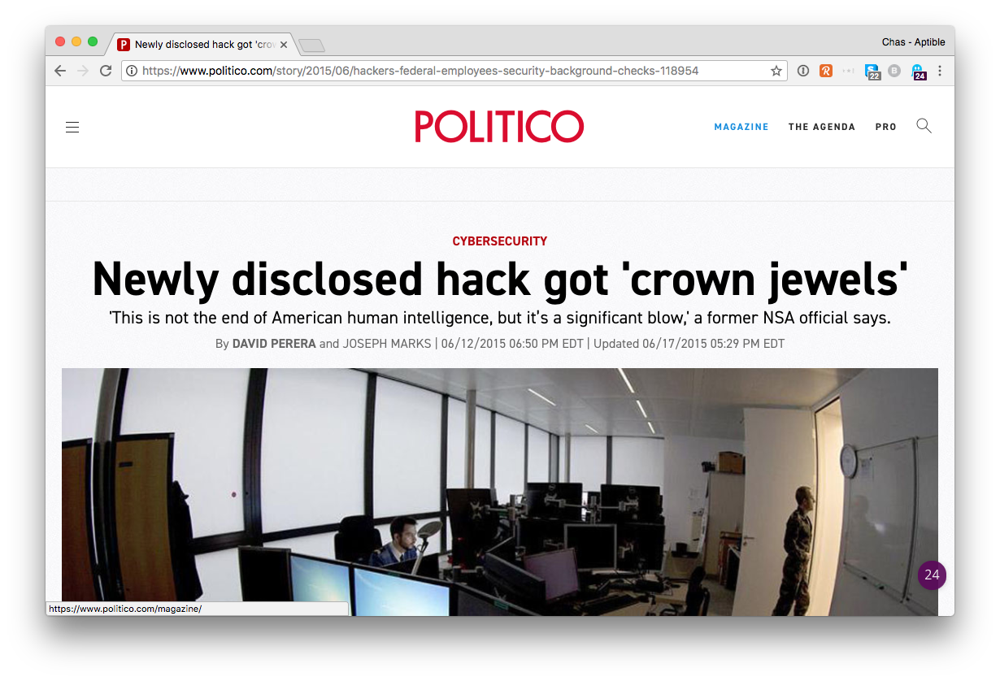

# How does culture affect risk?

 

Politico: “Hackers have breached a database containing a wealth of sensitive information from federal employees’ security background checks … The hackers are believed to have obtained data from a security intake form known as a Standard Form-86, which includes details such as financial trouble, past convictions, drug use and close relationships with citizens of other countries. The form is used for background checks of current, former and prospective federal employees.”

This was discovered in 2015. A House committee investigation (while potentially biased) called this a “failure of culture and leadership.” Even if you disagree with the politics, the facts do suggest that is true.

“The longstanding failure of OPM’s leadership to implement basic cyber hygiene, such as maintaining current authorities to operate and employing strong multi-factor authentication, despite years of warnings from the Inspector General, represents a failure of culture and leadership, not technology,” the report says.

Now you’re not OPM and may not have data that affects national security. But you can learn from this.
