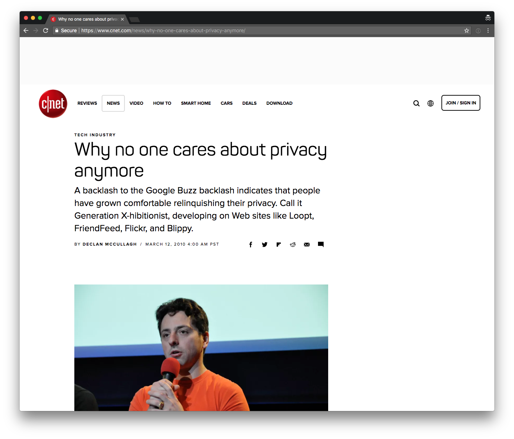
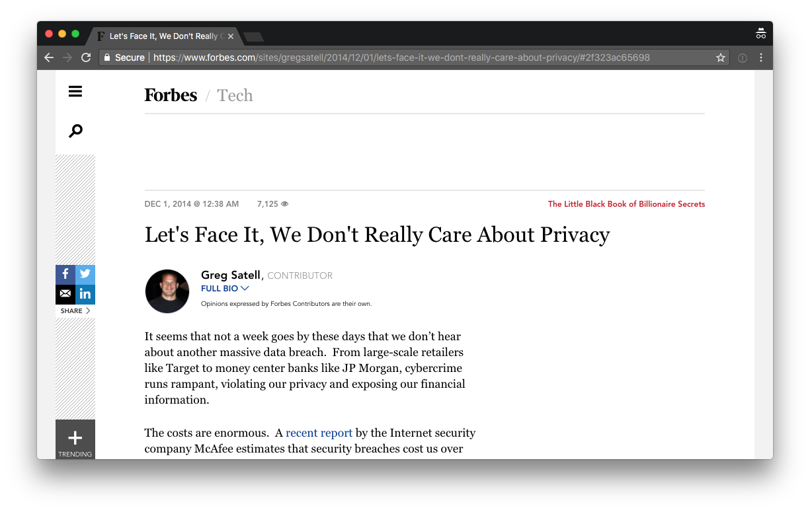
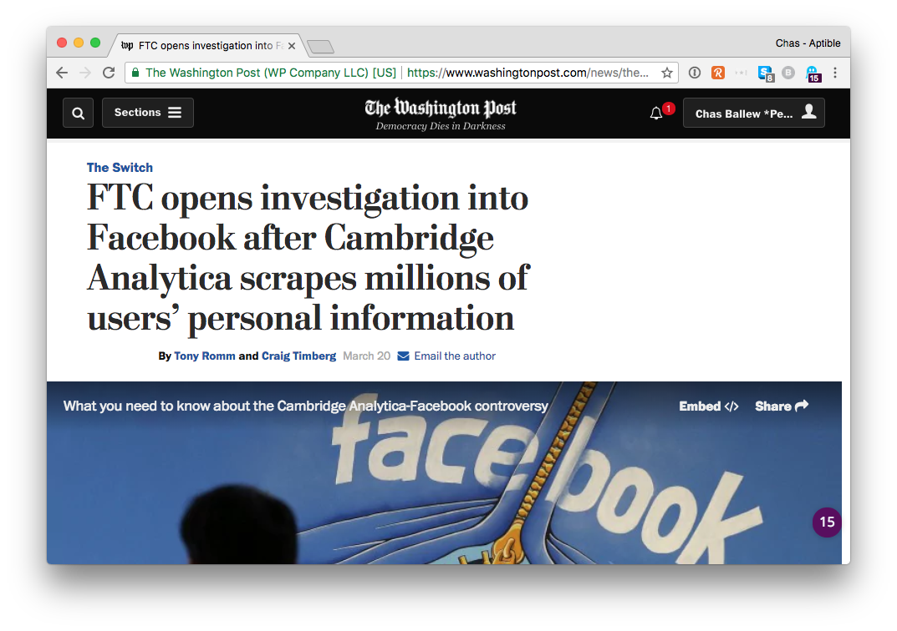
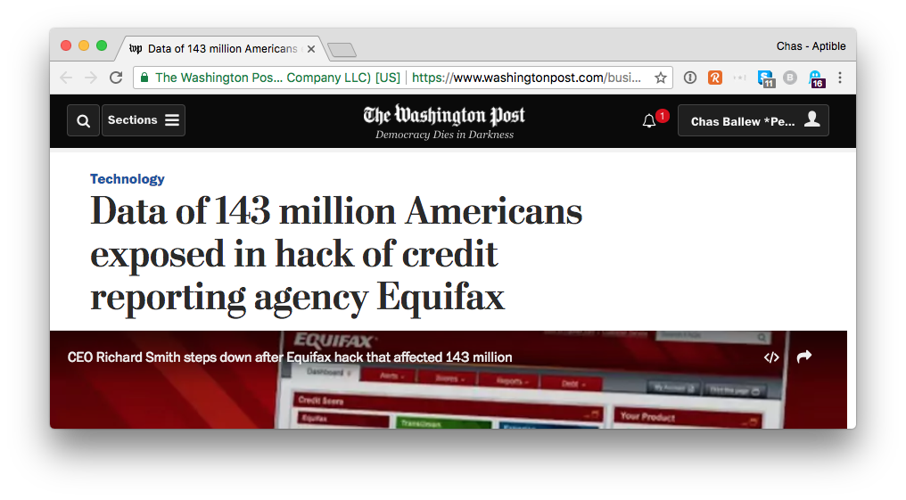

# The World has Changed

So, how’s this hot take from 2010 aging? Like a fine wine, right?

* * *

2014 now, great vintage.

* * *

 

So, Facebook has been in the news lately.

* * *

But no one cares about privacy anymore, right?

* * *

Businesses have been working with identifiable data, data relating to specific human beings, for decades. The entire ad tech industry is built on it. Why is this happening now?

* * *

Security is going in the same direction.

* * *

Breaches happen all the time, to all kinds of companies.
