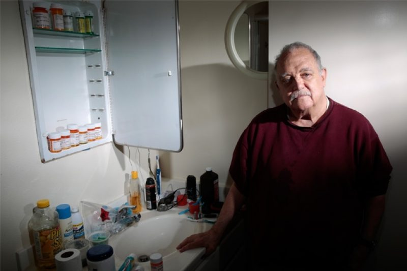

# Bringing it Home

If all of this seems scary, just remember: follow the rules we discussed here and ask questions if you are unsure.

Remember, the point of all of this privacy and security work is to protect individuals. The people whose data we protect are real people. They have faces, names, goals, and dreams. They have families and lives of their own.

> 
> #### Small-Scale Violations of Medical Privacy Often Cause the Most Harm
> Breaches that expose the health details of just a patient or two are proliferating nationwide. Regulators focus on larger privacy violations and rarely take action on small ones, despite the harm.
> 
> [Read the article](https://www.propublica.org/article/small-scale-violations-of-medical-privacy-often-cause-the-most-harm)

> 
> #### Impact Project
> After seven years, we’ve seen $23B invested into thousands of digital health companies. But we wanted to know: what has been the real-world impact of digital health?
> 
> [Read the article](https://impact.rockhealth.com/)

It’s a cliche that everyone wants to make the world a better place, but at your organization we really can, by being worthy of the trust these people place in us.
