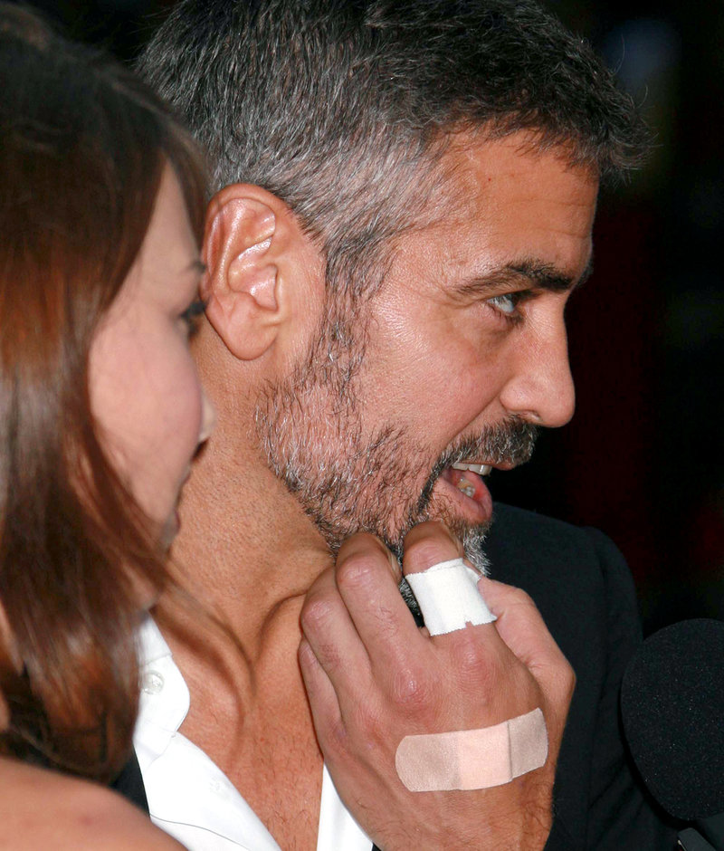
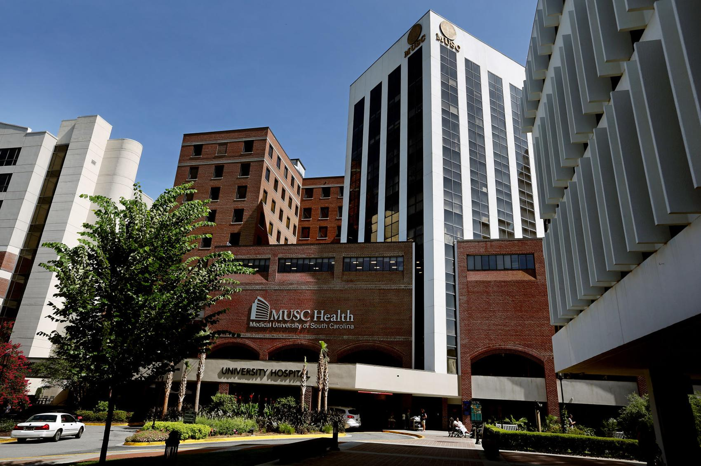

# Rule #1: We Only Use PHI for Work

Ok, Rule 1 hopefully is straightforward to understand: Only use PHI for work. Never, ever, ever end up like these folks:

> 
> #### Celebrities' Medical Records Tempt Hospital Workers To Snoop
> Improper access to the medical information of celebrities and people in the news has been a bane of health systems around the country for years. The proliferation of electronic medical records systems has made it easier to track and punish those who peek in records for no legitimate reason.
> 
> [Read the article](https://www.npr.org/sections/health-shots/2015/12/10/458939656/celebrities-medical-records-tempt-hospital-workers-to-snoop)

> 
> #### MUSC terminates employees who 'snoop' in patients' medical records
> Thirteen employees were fired in 2017 from the Medical University of South Carolina after administrators determined they had broken federal law by using patient records without permission, spying on patient files or disclosing private information.
> 
> [Read the article](https://www.postandcourier.com/health/musc-terminates-employees-who-snoop-in-patients-medical-records/article_b8b0abe6-1645-11e8-85e2-579077b71f57.html)

> #### 7 celebrity data breaches: When employees snoop on high-profile patients
> While large-scale data breaches are often the result of cyberattacks from outsiders, insider threats present a significant danger to healthcare organizations. Since hospital employees have access to EHRs, there is the risk they may access records outside of their traditional job duties — especially if hospital patients are high-profile individuals or celebrities.
> 
> [Read the article](https://www.beckershospitalreview.com/healthcare-information-technology/7-celebrity-data-breaches-when-employees-snoop-on-high-profile-patients.html)

> #### Neb. hospital workers fired for violating Ebola patient's privacy
> The Nebraska hospital that treated an American aid worker infected with Ebola has fired two workers accused of violating the man's privacy by looking at his medical file.
> 
> [Read the article](http://www.modernhealthcare.com/article/20140927/INFO/309279886)

### Never access, use, or disclose PHI for any reason other than that you’re strictly doing your job at your organization.

### Never access PHI because you’re curious, bored, or for any other non-work reason.

### Never share PHI with anyone, even orally in person, over the phone, etc. unless it’s for work. This includes conversations with co-workers, gossip, etc.

_Disclaimer: Everything is audited - all systems that handle PHI are required to have logs._

We’ll talk about your organization's workforce sanctions and HIPAA breach reporting later in this training, but for now just be aware that using or disclosing PHI for unauthorized purposes can land both you and your organization in serious trouble.

**When in doubt, ask your Security Officer.**

If you’re curious, HHS has published a great summary of the Privacy Rule [here](https://www.hhs.gov/hipaa/for-professionals/privacy/laws-regulations/index.html). That said, don’t make any decisions on your own, ask your Privacy Officer or your Security Officer.
