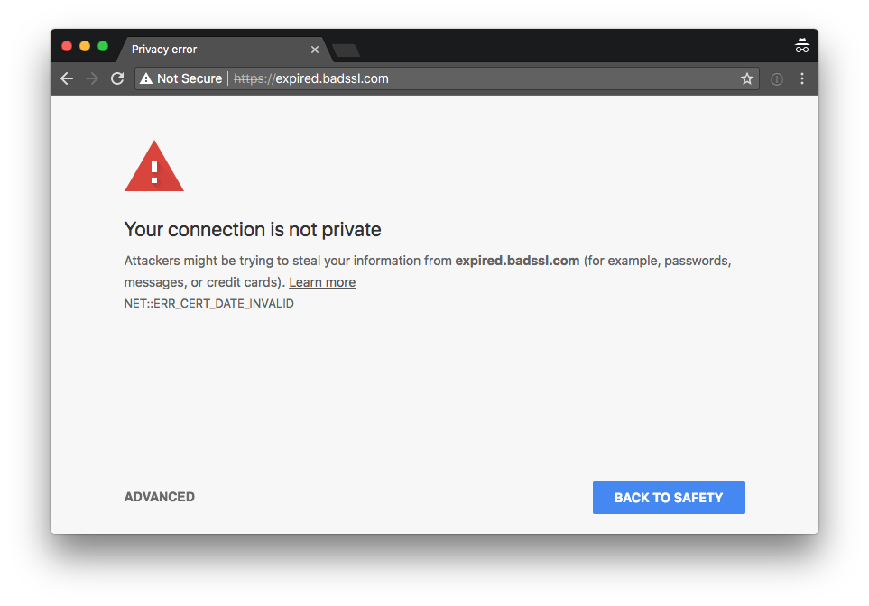
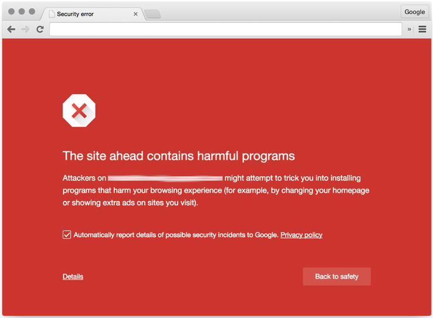

# Browser Risks

*   Malicious extensions
*   Malicious Javascript/ads
*   SSL/TLS redirection

  

Malicious browser extensions and malware delivered through the browser are increasingly common.

> #### I am one of the developers of a popular Chrome extension and we've been approached by malware companies that have tried to buy us. AMA!
> I am one of the developers of Honey, a popular Chrome extension with 700K+ users. Over the past year we've been approached by malware companies that have tried to buy the extension, data collection companies that have tried to buy user data, and adware companies that have tried to partner with us. We turned them all down.
> 
> [Read the article](https://www.reddit.com/r/IAmA/comments/1vjj51/i_am_one_of_the_developers_of_a_popular_chrome/)

> 
> #### Look Out: Chrome Extension Malware has Evolved
> YOU ALREADY KNOW to be wary of third-party Android apps, and even to watch your back in the Google Play Store. A flashlight app with only 12 reviews might be hiding some malware as well. But your hyper-vigilant download habits should extend beyond your smartphone. You need to keep an eye on your desktop Chrome extensions as well.
> 
> [Read the article](https://www.wired.com/story/chrome-extension-malware/)

> #### A phony ad-blocking Chrome extension infiltrated Google's official Web Store
> A phony AdBlock Plus extension was listed in Chrome’s official Web Store up until today, with more than 30,000 people having downloaded it. Anonymous cybersecurity personality @SwiftOnSecurity called attention to the fake extension and pointed out that imposters, like this fake AdBlock Plus, continue getting through the Google's vetting process and into the store's listings. That presents an especially tricky situation for users who might not carefully check each extension’s developer.
> 
> [Read the article](https://www.theverge.com/2017/10/9/16449236/google-chrome-extensions-malicious-security-controls)

> 
> #### Browser Extensions Are a Privacy Nightmare: Stop Using So Many of Them
> Browser extensions are much more dangerous than most people realize. These small tools often have access to everything you do online, so they can capture your passwords, track your web browsing, insert advertisements into web pages you visit, and more. Popular browser extensions are often sold to shady companies or hijacked, and automatic updates can turn them into malware.
> 
> [Read the article](https://www.howtogeek.com/188346/why-browser-extensions-can-be-dangerous-and-how-to-protect-yourself/)

Many modern browsers, such as Chrome, will show you a warning message before you visit a site that is suspected of containing malware or phishing. If you see these warnings heed them.

**If you accidentally misclicked, tell your Security Officer immediately.**

Remember, even if you are on encrypted WiFi, your connection to the Internet is not secure unless you are using HTTPS or some other encrypted protocol (like using a VPN, etc.)

If you’d like to play around and see some SSL/TLS browser errors visit: [https://badssl.com/](https://badssl.com/)
