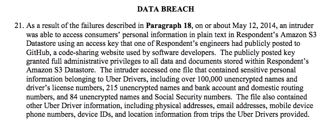

# Credential leakage and linked accounts

In addition to passwords being reused or easily guessed, just plain losing control over a credential happens all the time.

These might be passwords, API keys, or any other credential that is supposed to remain secret.

**Never tell anyone your passwords**  
**Never copy/paste it into email, Slack, SMS, or any other form of messaging**  
**Never commit passwords or credential to code**

The image above is a screencap from an FTC complaint against Uber:

[https://www.ftc.gov/system/files/documents/cases/1523054_uber_technologies_complaint.pdf](https://www.ftc.gov/system/files/documents/cases/1523054_uber_technologies_complaint.pdf)

Evidently the backstory was that the GitHub repo with the AWS S3 API access key was private, but multi-factor authentication was not enabled. The attackers got access to GitHub, and used that to get access to the API key.

If you learn a credential has been exposed in a non-secure channel, contact your Security Officer immediately.
