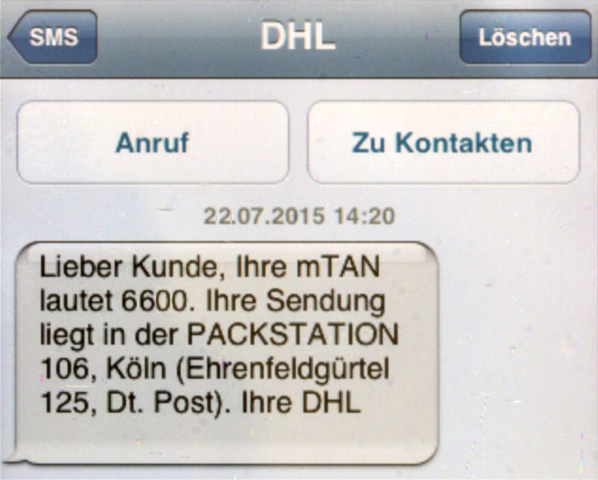
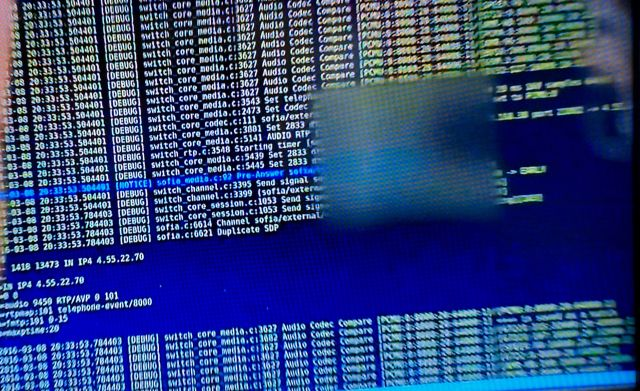

# 2-factor authentication

Multi-factor authentication (also called 2-factor authentication) is excellent. Use it whenever possible.

Your Security Officer will give you a list of the services that must have multi-factor authentication enabled.

When possible, use Time-based One Time Password (TOTP) or hardware security key authentication as your second factor. Try to avoid SMS-based multifactor. While it may be convenient, it is very easy for an attacker to intercept the code or trick your cell phone carrier into porting your number over:

> 
> #### Thieves drain 2fa-protected bank accounts by abusing SS7 routing protocol
> A known security hole in the networking protocol used by cellphone providers around the world played a key role in a recent string of attacks that drained bank customer accounts, according to a report published Wednesday.
> 
> [Read the article](https://arstechnica.com/information-technology/2017/05/thieves-drain-2fa-protected-bank-accounts-by-abusing-ss7-routing-protocol)

> 
> #### How hackers eavesdropped on a US Congressman using only his phone number
> A US Congressman has learned first-hand just how vulnerable cellphones are to eavesdropping and geographic tracking after hackers were able to record his calls and monitor his movements using nothing more than the public ten-digit phone number associated with the handset he used.
> 
> [Read the article](https://arstechnica.com/information-technology/2016/04/how-hackers-eavesdropped-on-a-us-congressman-using-only-his-phone-number/)

> 
> #### Identity Thieves Hijack Cellphone Accounts to Go After Virtual Currency
> Hackers have discovered that one of the most central elements of online security — the mobile phone number — is also one of the easiest to steal.
> 
> [Read the article](https://www.nytimes.com/2017/08/21/business/dealbook/phone-hack-bitcoin-virtual-currency.html)
