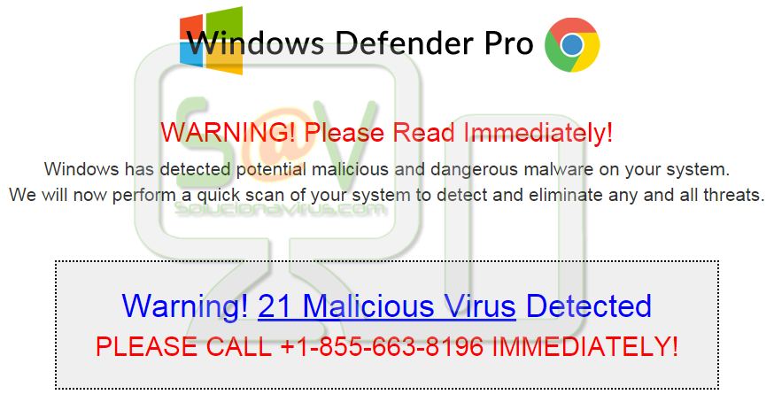

# Social Engineering in the Browser

Also note that ads, popups, and other browser activity is a target for delivering social engineering scams.

Apple has a support article on this: [https://support.apple.com/en-gb/HT204759](https://support.apple.com/en-gb/HT204759)

Google has some good examples for Chrome: [https://support.google.com/webmasters/answer/6350487/](https://support.google.com/webmasters/answer/6350487/)

If you are getting unwanted pop-ups, ads, or other strange activity on your computer, you may have a security issue. Never try to fix it on your own: Tell your Security Officer immediately.
