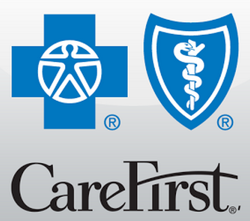
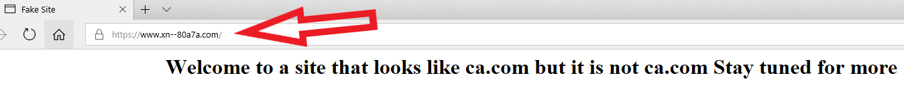

Can you spot the difference between these two sites?

One is the real site, the other is a phishing site. The domain for the phishing site was used in a 2015 attack against some health insurance companies:

> 
> #### Carefirst Blue Cross Breach Hits 1.1M
> CareFirst BlueCross BlueShield on Wednesday said it had been hit with a data breach that compromised the personal information on approximately 1.1 million customers. There are indications that the same attack methods may have been used in this intrusion as with breaches at Anthem and Premera, incidents that collectively involved data on more than 90 million Americans.
> 
> [Read the article](https://krebsonsecurity.com/2015/05/carefirst-blue-cross-breach-hits-1-1m/)

If you think that’s tough to detect, check out lookalike domains:

> 
> #### Look-Alike Domains and Visual Confusion
> How good are you at telling the difference between domain names you know and trust and impostor or look-alike domains? The answer may depend on how familiar you are with the nuances of internationalized domain names (IDNs), as well as which browser or Web application you’re using.
> 
> [Read the article](https://krebsonsecurity.com/2018/03/look-alike-domains-and-visual-confusion/)
