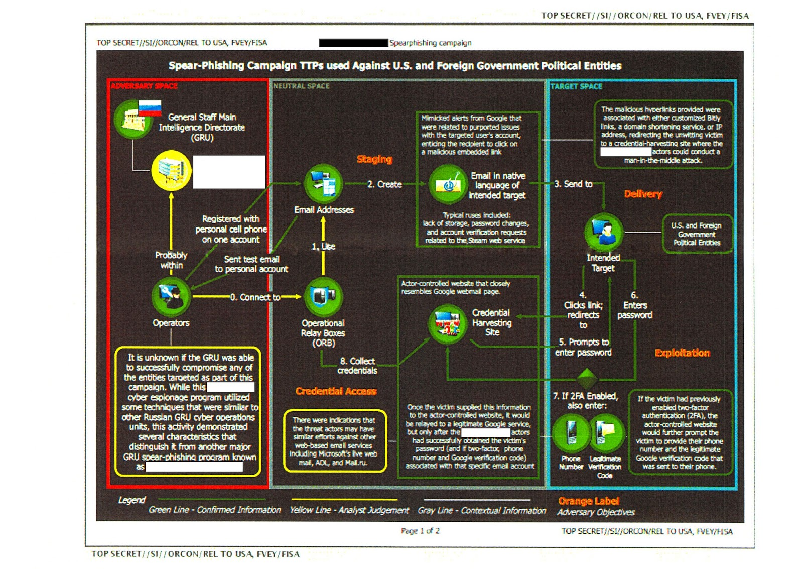
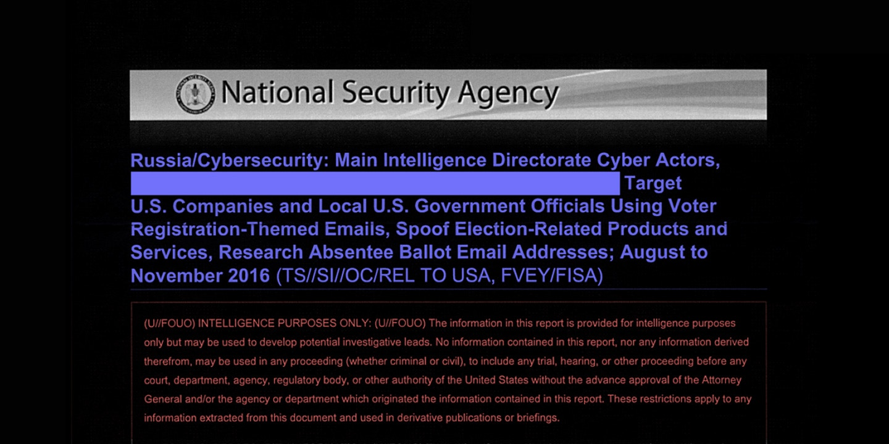

Good phishing attacks can also intercept and use 2-factor authentication codes. The other big Russian electoral hack last year also used spear phishing. Some leaked NSA slides show how the same fake sites that capture passwords can also capture 2FA codes:

> 
> #### Top-Secret NSA Report Details Russian Hacking Effort Days Before 2016 Election
> Russian Military Intelligence executed a cyberattack on at least one U.S. voting software supplier and sent spear-phishing emails to more than 100 local election officials just days before last November’s presidential election, according to a highly classified intelligence report obtained by The Intercept.
> 
> [Read the article](https://theintercept.com/2017/06/05/top-secret-nsa-report-details-russian-hacking-effort-days-before-2016-election)
