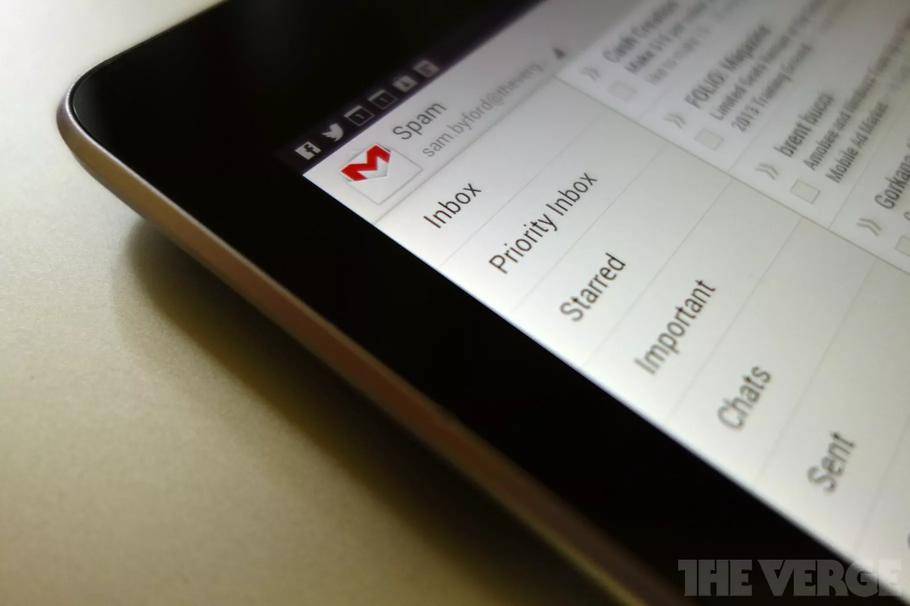

Phishing and social engineering aren't just limited to email. In May of 2017, some Google users were targeted by a malicious phishing scheme that used “Sign in with Google” functionality to get access to Google user email permissions:

> 
> #### Google Docs users hit with sophisticated phishing attack
> If someone invites you to edit a file in Google Docs today, don’t open it — it may be spam from a phishing scheme that’s been spreading quickly this afternoon. As detailed on Reddit, the attack sends targets an emailed invitation from someone they may know, takes them to a real Google sign-in screen, then asks them to “continue to Google Docs.” But this grants permissions to a (malicious) third-party web app that’s simply been named “Google Docs,” which gives phishers access to your email and address book.
> 
> [Read the article](https://www.theverge.com/2017/5/3/15534768/google-docs-phishing-attack-share-this-document-with-you-spam)
