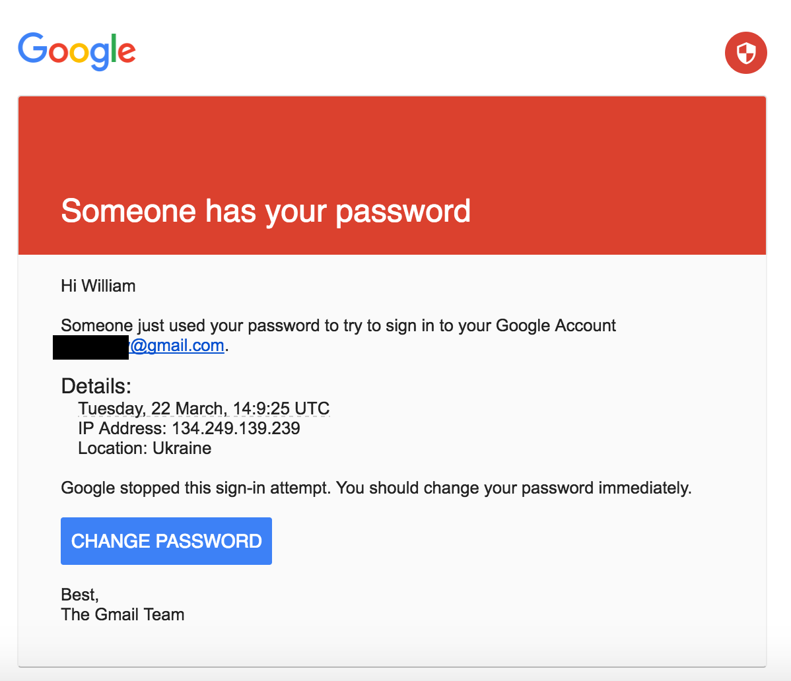

# Phishing

This is an example of a good phishing email. Phishing is one of the most prevalent social engineering scams around. Phishing usually involves email or SMS and tries to instill a sense of emergency or panic in you, to get you to make a mistake. It’s called “spear phishing” when the attack is targeted at a high-value target.

The spear phishing email shown above was discussed in the NY Times’ expose on how Russian hackers attacked the Democratic National Committee in 2016:

> 
> #### The Perfect Weapon: How Russian Cyberpower Invaded the U.S.
> When Special Agent Adrian Hawkins of the Federal Bureau of Investigation called the Democratic National Committee in September 2015 to pass along some troubling news about its computer network, he was transferred, naturally, to the help desk.
> 
> [Read the article](https://www.nytimes.com/2016/12/13/us/politics/russia-hack-election-dnc.html)

In the attack above, clicking “Change Password” redirected the victim to a fake site that looked like Google, but just stole his password.
