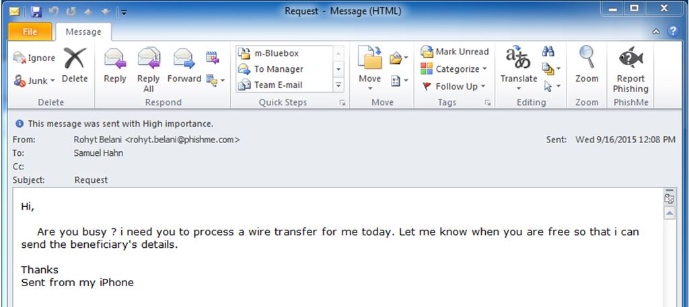

# Let's talk about social engineering

Social engineering is when an attackers tricks you into performing an action for them, or divulging confidential information (like a password!).

For example, you may have heard of “CEO” scams where an attacker either gets access to an executive’s email, or impersonates an executive with phishing, and then convinces someone to wire money:

> 
> #### FBI: $2.3 Billion Lost to CEO Email Scams
> The U.S. Federal Bureau of Investigation (FBI) this week warned about a “dramatic” increase in so-called “CEO fraud,” e-mail scams in which the attacker spoofs a message from the boss and tricks someone at the organization into wiring funds to the fraudsters. The FBI estimates these scams have cost organizations more than $2.3 billion in losses over the past three years.
> 
> [Read the article](https://arstechnica.com/information-technology/2017/05/thieves-drain-2fa-protected-bank-accounts-by-abusing-ss7-routing-protocol)

Facebook and Google lost a combined $100M to one scammer:

> #### Exclusive: Facebook and Google Were Victims of $100M Payment Scam
> When the Justice Department announced the arrest last month of a man who allegedly swindled more than $100 million from two U.S. tech giants, the news came wrapped in a mystery. The agency didn’t say who was robbed, and nor did it identify the Asian supplier the crook impersonated to pull off the scheme.
> 
> [Read the article](http://fortune.com/2017/04/27/facebook-google-rimasauskas/)

These attacks work because they convince you, the victim, to ignore or sidestep basic security precautions.
